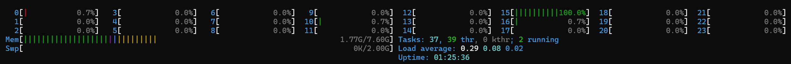

# seg4print 

This is a repository forked from [SynthSeg](https://github.com/BBillot/SynthSeg). We, the [Edden et al.](https://www.gabamrs.com/) at Hopkins, want to 3D print the well-segmented brain regions for our scans. 

## Regular Workflow 

Please download the deep learning model [weights](https://mitprod-my.sharepoint.com/:u:/g/personal/bbillot_mit_edu/Ebqxo6YgUmBJkOML0m8NSXgBrhaHG7iqClFXRXPinS6FGw?e=DzKf1p) and paste the files to ./models folder.

We will only call CPUs in the regular workflow to make it as realizable as possible. The whole processing should be done within 30 seconds.

Please download and configure [Anaconda](https://www.anaconda.com/download) on your device. Launch a conda terminal and create a new envrionment with ```python==3.8```. You can customize the environment name as you like. 

```powershell
conda create -n env_name python=3.8
```

Then go to the repository folder and install the necessary libraries within your new environment. 

```powershell
conda activate env_name
cd your/address/to/seg4print
python -m pip install -r requirements_python3.8.txt
```

After successful installment, run the segmentation command in the repository folder via your environment. (This will be a convention for every time use.) 
- You can indicate your input and output .nii file name by ```--i``` and ```--o```.
- You can indicate the number of CPU cores called for this processing by ```--threads```. The more threads gety involved, the quicker result you can get, but always keep in mind this number can not exceed the cores you owned.  
- You can always crop the MRI model to indicate the region of interest by ```--crop```. It follows the DICOM coordinate(LPS).

```powershell
conda activate env_name
cd your/address/to/seg4print
python ./scripts/commands/SynthSeg_predict.py --i ./input.nii --o ./output.nii --cpu --threads 20 --crop 160 192 160
```

After you get the segmentation result as ```output.nii```, call the following command to translate it into left and right sliced STL files to print. The STL files will be saved in the same folder automatically. We scale the brain model to 1/8 by default in order to print it in no time. Feel free to change the argument ```--scale``` by need. 

```powershell
python gwm_stl.py --nii "./output.nii" --scale 0.125
```

## GPU Acceleration

(The GPU workflow is only for Windows so far.)
<br>
(We noticed that GPU mode only supports one CPU thread to do the pre/post processing, and hence the workflow is unfortunately slowed down. There will be an update as soon as we fixed it.)


<p align="center"><em>All the available CPU threads are called in the CPU mode.</em></p>


<p align="center"><em>Only one CPU thread is called in the GPU mode :(</em></p>

Please download the deep learning model [weights](https://mitprod-my.sharepoint.com/:u:/g/personal/bbillot_mit_edu/Ebqxo6YgUmBJkOML0m8NSXgBrhaHG7iqClFXRXPinS6FGw?e=DzKf1p) and paste the files to ./models folder.

Please download WSL2 in your Windows PowerShell by the following commands. This will help you create a lightweight Ubuntu in your Windows system. 

```powershell
wsl --version
wsl --install
wsl --update
```

Please download [Docker Desktop](https://docs.docker.com/desktop/setup/install/windows-install/) on Windows. This helps you get an isolated environment to run the tensorflow-based code. Then launch your PowerShell and activate your WSL2 by

```powershell
wsl
```

Then go to your local address to this repository and create a new Docker image using our configuration. You can customize `name:tag` for your image and remember to keep it consistent in the following commands. 

```powershell
cd your/address/to/seg4print
docker build -t name:tag .
```

After a successful installment of your image, we will launch a container for that. Remember your ```seg4print``` folder should always be the workspace for the container, so always go to the address first. 

```powershell
cd your/address/to/seg4print
docker run --gpus all -it --rm -v "${PWD}:/workspace" -w /workspace name:tag bash
```

Inside your container, now run the model. 

```powershell
python ./scripts/commands/SynthSeg_predict.py --i ./input.nii --o ./output.nii --fast --crop 160 192 160
```

If you get a slow processing, here are someways to help you monitor the device.
<br>

GPU
```powershell
nvidia-smi -l 1
```

CPU
```powershell
htop
```